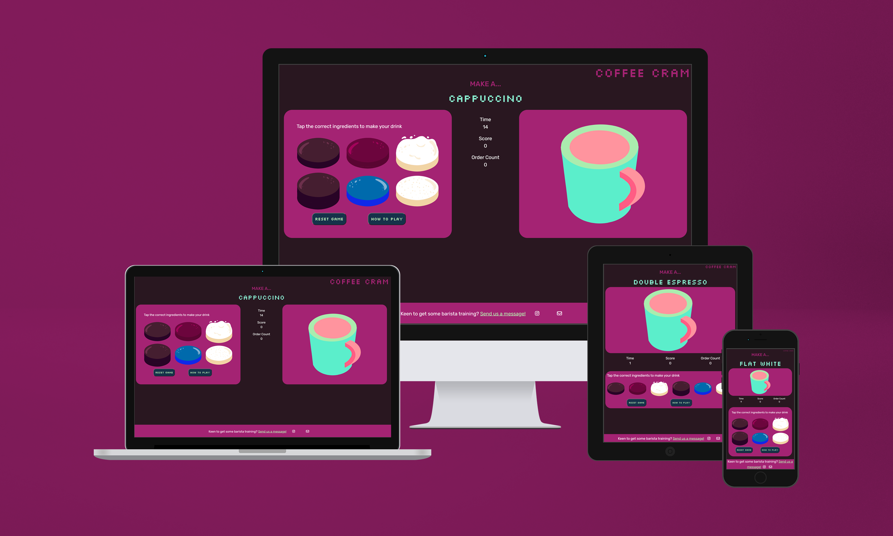

# Coffee Cram

For my Milestone 2 project I have created a barista simulation game in javascript. The game randomly generates a drink name for the user to then select the correct ingredients to create that particular drink.
I wanted to create something fun that could potentially be used as a tool for users to brush up on their coffee drink knowledge, perhaps even during a training setting as an ice-breaker exercise. As in my previous project, I have proceeding with the mobile first' design technique to ensure my game can be accessed on the go on mobiles and tablets, not just on laptops and computers, so the site is fully responsive.

[Link to Coffee Cram live site](https://kateuj.github.io/coffee_cram/)

## Table of Contents

1. [Planning & Development](#planning--development)
2. [Features](#features)
3. [Testing](#testing)
4. [Deployment](#deployment)
5. [Languages](#languages)
6. [Media Queries](#media-queries)
7. [Software](#software)
8. [Code](#code)
9. [Credits](#credits)

# Planning & Development #

### Site Purpose
This game is been designed mainly to create a positive emotional response through entertainment. It could also be used as an informal and fun introduction for barista training where the trainer could use this as a tool to test their trainee's knowledge of drinks before and after training to have a constructive comparison on how their knowledge has been built and any areas for improvement.

### Target Audience

Broadly, the game is aimed at anyone with an interest in coffee, which could include people seeking entertainment in the form of a quiz, but also as mentioned above for trainee barista to revise their knowledge, as well as barista trainers to used as an energy boosting / ice-breaking tool in training sessions with their trainees.

### User Needs

#### User Stories
1. User interested in coffee wants seeks coffee content based entertainment.
2. A barista trainee wanting to test their drink making knowledge.
3. A barista trainer uses the game as a tool to test their trainees' knowledge.

### Site Objectives

* Test user's knowledge of coffee drink making.
* Give the user a positive emotion experience with bright and fun colours and imagery.
* Build responsive game that works on mobile, tablet and desktop.
* Make the game easy to use with rules explained.
* Easy to navigate around and find key information.
* The option to view instructions anytime, to help the user revise the ingredients for each drink and refresh their memory easily.
* A good UI site flow.
* Provide the users with a way of contacting me and submitting a message to my email inbox.
* To be accessible for screen readers.
* To be able to reset the game easily.
* Links to the creator's social media in footer.

### Approach

* User experience design will be planned and carefully considered when designing the flow of layout of the game.
* The site will provide users links through to my social media accounts to contact me.
* The content of the site will be family-friendly and accessible to all.
* The game design will be consistent and visually engaging for the users.

### Research

I looked at other javascript-based games before making a decision on what I wanted to create, to see what was possible using the javascript concepts and skills I have learnt recently.

Sites included:
* [Burger Make](https://www.culinaryschools.org/kids-games/burger-maker/)
* [Hang Man](https://codepen.io/cathydutton/pen/JjpxMm)

Thoughts noted:
* Minimalist design.
* Responsive design.
* Game on one page.
* Pop up with instructions included.

All of the above, I have reflecting in the design of my own website.

### Wireframes

I used Figma and Balsamiq to plan and design my wireframes and user journey. I like using Figma in particular because it always you to brainstorm and keep all ideas and inspiration in one place as a singular visual to refer back to, which has been very useful throughout the project. I designed my site in mobile format initially before moving onto bigger screens, to ensure responsiveness was considered, especially since most users will predominantly use their phones to access this game.
I have changed a features along the way after considering user experience, for instance, I chose not to add a drop down menu at the top of the mobile version due to the site only being two pages long and felt it unnecessary in the end, due to the link to the contact page being below the game. If I had included an accordion nav bar at the top it would have pushed the game content further down the screen, meaning the user may need to scroll to see all the ingredients, which I decided was not acceptable for a good user experience.

#### Mobile Design Wireframe

#### Tablet Design Wireframe

#### Desktop Design Wireframe

[Link to my Figma page](https://www.figma.com/file/sE1FXwAGFZf3FEYIDAB8l0/Milestone-2---Coffee-Cram?type=design&node-id=0%3A1&mode=design&t=spVJTdSswAGCzuT1-1)

### Colour Scheme

After looking at coffee based content, branding and cafe simulator games, I found a lot of them to have quite muted, bland colour palettes, due to coffee being brown and having to work with that colour predominantly. However I was adamant to make this game as visually exciting as possible, so I looked at retro game palettes as well as bright 'vaporwave' colours to form my own striking colour palette to engage the user. The retro look and feel was intentional to invoke a cosy, reminiscent experience for users.
I made sure I had a good mix of high contrasting colours for good readability, which I have learn is important to consider when designing a website or application to ensure inclusivity for all users.

### Graphics

I was conscious that with 6 different ingredients and over 6 different variations of drinks, that this game could end up looking visually confusing if not approached carefully. I chose to create simple, isometric, flat graphics, which are in-keeping with the retro feel, but also creating a minimalist look and feel to keep the game approachable and not too overwhelming for the user.

### Typography

I chose a retro pixelated style font for headings and the logo for the game to accentuate the retro feel of the game, but also coupled it with Rubik, a simple, easy to read sans-serif font, for any body text sentences etc. to maintain good readability and in turn a good user experience.

# Features #

## Existing Features

### General

* My site is fully responsive and can be viewed and used effectively on all screen sizes down to 320px width by 480px height.
* I have considered readability contrast carefully for all visual elements.
* I have included a Favicon page tab icon to make the page look professional and consistent.

### Logo

* I created my simple text logo using the Silkscreen font to give it the retro gaming feel.

## Game page

* To keep things clear I have sectioned out the page, so that the ingredients are on the left and the coffee drink is on the right to be created and filled up by the user. In mobile and tablet, the cup appears at the top with the ingredients at the bottom so the user instinctively reads the drink name first, sees the cup to fill and then proceeds to the ingredients to make choices.

### Instructions pop-up

* I created an animated gif for the centre of the landing page to add to the initial visual impact of the site to draw users in. I have kept it in a hand-drawn style to keep it fun and intriguing for a younger audience and to get my own personality across to the user to make it feel more casual and relatable.

### Random drink generator

* This title prints a random drink from an array in the script-game.js file.
* I would like to iterate this code to get it to a stage where it will stop the same drink appearing twice consecutively. 

### Ingredient text overlays

* When the user clicks on an ingredient in the mobile version, or hovers over in the desktop version, the name of ingredient appears as a text overlay over the graphic. I felt this was intuitive for the user and also maintained the minimalist visual due to there not being an overload of text on the page.

### Changing coffee cup graphic

* The coffee cup image changes if the correct ingredient is clicked for the drink name that has been generated at the top of the page. It go through each step, gradually filling up with each ingredient until the drink is complete.

### Timer, score count and order count

* Each drink gets a 15 second timer for the user to guess the ingredient sequence correctly. For every incorrect ingredient clicked, the player loses 5 points in their score, and for every correctly guessed drink sequence, they get 10 points. The order count also keeps track of how many drinks have been successfully completed so far.

### Try again pop-up

* For each incorrect ingredient clicked, a timed pop-up appears prompting the user to try again and check the how to play section if unsure.

### Well done pop-up

* A well done pop-up appears for every correct sequence completed so the user knows the game has progressed and they are moving onto the next drink.

### Footer

* I have included links to my Instagram profile in the footer along with an icon that links to the contact form page. This way if the user is more driven by icons than text, they will instinctively know to click the email icon to get in touch, versus the users who might be encouraged or prompted to contact from the text and 'click here' link I have included within the footer too.
* The external link to Instagram opens a separate window, whereas the internal link to my contact form redirects to the contact page within the same window, which is good practice when designing a user journey and saves several windows opening for the user for the same website.

## Get in touch page

* I have included a functional contact form created using emailjs for users to contact me.

### Contact Form

* All inputs are required
* The contact form checks the information is suitable before sending - the email input will not work with text, an email address must be added for the form to submit.

## Thank you page

* A quick message to the user to confirm their message has been submitted and to redirect them back to the game page within 5 seconds.

## Error 404 page

* Should any errors occur, the user will be directed to this page. I have included this page in the sendmail js file function, should the form not successfully submit. The page has a button that links back to the game page, so the user can return back to the main site easily and quickly.

## Possible Future Features

* Background music for ambience
* Confetti animation when the user guesses the correct sequence
* More drink variations

# Testing

## Testing during Development

* Throughout the process of making this website, I tested my code and CSS a lot using the preview window extension within VS Code, as well as within a chrome browser. With chrome browser I could Chrome Developer Tools to test responsiveness as well as troubleshoot any spacing issues or bugs.
* I would also consistently commit and push work to Github to then view live site and check responsiveness on my mobile and tablet devices, as well as passing onto friends and family to test on their devices.
* I have also tested my site in the main browsers available, which include:

  * Google Chrome
  * Mozilla Firefox
  * Apple Safari
  * Microsoft Edge

### Testing the Home page

* **Body content**
  * I have used the Bootstrap grid system in my site to structure my pages, as I found it to be reliable to use in the Code Institute exercises for responsiveness. So, I tested this section with Chrome Developer Tools, editing with CSS and media queries to make sure responsiveness was suitable on all screen sizes.
  * The portrait GIF in the centre was initially appearing under the nav bar on smaller screens when tested, so I resolved this by creating media queries for the smaller screen sizes to change the top margin above it where appropriate.
  * The 3 images were impactful on the larger screens but from tablet screen-size downward, the two image on one line was enough, so I change my strategy in the end to make the third image disappear on smaller screens using a media query.

* 

### Testing the Contact Form page

### Testing the Thank you page
  * Successfully re-directs back to site after 5 seconds when tested.

## Validator Testing

### W3C Validator
I ran my site pages through the W3C validator and I received one error for a missing alt tag for an image on my index page. 

I corrected the code and all three pages now return no html errors.

### CSS Jigsaw Validator
I put the CSS stylesheet through the Jigsaw Validator and found one Parse error.

## Lighthouse Performance Testing

Using the Chrome Developer Tools Lighthouse reports, I was able to test the performance of my site pages and improve it as a result.

### Desktop
My initial desktop performance came out as below:

  

To improve my score, I did the following:
* Updated the coffee menu pop-up image to a higher res version.
* Added alt tags to all my images.

My score in accessibility, best practices and SEO improved after all these changes. However due to improving the quality of the coffee menu image as it had suggested, the performance reduced slightly, but all now in the green:

  

### Mobile

The performance came out as:

* Performance on mobile could still be improved by reducing image sizes, but this is difficult to do when the images need to be large enough for larger screens in this particular instance.

# Deployment

## GitHub pages
I used GitHub pages to deploy my site. This required me to go to my project repository and then:
1. Click on the 'Settings' tab.
2. Select 'Pages' from the menu that appears on the left.
3. Select 'Deploy from a branch'.
4. Select 'Main' in the drop-down menu called 'Select Branch'.
5. Then alongside 'Main', there is a folder dropdown where you select '/Root'.
6. Click 'Save' button.
7. Refresh the page and a link to the live project will appear at the top of the page.

## Forking a GitHub repository
Forking allows users to make a copy of an original repository in GitHub and view and make changes to it without changing the original repository.
To create a fork:
1. Once logged into GitHub, follow the link to your chosen GitHub repository, or use the search bar to find it on the GitHub home page.
2. Once in the repository window, click the 'Fork' drop down arrow button in the top right-hand corner.
3. Select 'Create new fork'.
4. Check the details in the window before clicking the green 'Create Fork' button.
5. You will now be able to find the copy of the repository in your own GitHub account.

## Making a Local Clone
1. Once logged into GitHub, follow the link to your chosen GitHub repository, or use the search bar to find it on the GitHub home page.
2. Once in the repository window, click the green 'Code' button.
3. To clone the repository using HTTPS, copy the link provided below the HTTPS header.
4. Open a terminal in your code editor.
5. Change the location in the current working directory to where you want the cloned directory to be created.
6. Type "git clone" into the terminal, and then paste the URL you copied and click enter.
7. This should have created a local clone of the repository.

Here is the live link to my website - <https://kateuj.github.io/coffee_cram/index.html>

# Languages

* I used HTML, CSS and Javascript to create this site.
* Bootstrap v5.3.2 was used and built upon for creating the general layout with its grid system.

# Media Queries

* I used Media Queries to debug and override some display issues that were not rectified with Bootstrap's responsive layouts.

# Software

* I used Visual Studio Code to create, edit, preview and push my code to my Github repository.
* Git and Github for version control.
* I used Procreate for my graphics, planning and design work.
* Balsamiq for wireframes.
* Figma was used as a design board to lay out my wireframes and keep a copy of my design thought process all in one place.
* Adobe Photoshop was used to create visual mock-ups for this document, as well as reformatting all my images as .webp files to reduce file size and in turn improve the performance of my site.
* EmailJS was used in the background to help me create a functional contact form.

# Code

* **Text overlay on ingredients** - I followed this tutorial and tailored it to my own style and needs [Text image overlays](https://www.youtube.com/watch?v=Qt-70hrdJZI&ab_channel=LearnWeb)

* **Modal pop-ups** - I followed this tutorial to create my pop-ups and tailored it to my own needs [Pop-ups in Javascript](https://www.youtube.com/watch?v=r_PL0K2fGkY&ab_channel=FlorinPop)

* **Contact form** - this was based on the code used in the 'Putting it all together' emailJS exercises of Milestone 2 on Code Institute.

* **Footer** - code is based on the code used in the 'Love Running' exercise of Code Institute.

* **Thank-you page** - I used this code snippet to get the Thank You page to re-direct back to the site after 5 seconds. This was from a [Stack Overflow thread.](https://stackoverflow.com/questions/3292038/redirect-website-after-specified-amount-of-time)

* **Favicon** - I used a [Favicon generator](https://favicon.io/) to create the appropriate files for me to upload to my site, as well as this code snippet to install it site-wide.

# Credits

* Code Institute Bootstrap lessons helped me with working out how to use the Bootstrap grid layout on my pages.
* Google fonts for ['Silkscreen' typography.](https://fonts.google.com/specimen/Silkscreen) and ['Rubik' typography.](https://fonts.google.com/specimen/Rubik)

## Content

* [Image for visual mock up at top of README document by CosmoStudio</a> on Freepik.](https://www.freepik.com/psd/desktop-tablet-phone-mockup)
* All graphics are my own work.

### Thanks

* Martina Terlevic my CI mentor, for her invaluable advice.
* [Kera Cudmore](https://github.com/kera-cudmore/readme-examples/blob/main/README.md#italic-bold-and-code) for showing how to form a README file.
* Liz Curtis my friend and fellow coder, for listening and offering suggestions when I was brainstorming logic and troubleshooting solutions.
* The big and little human beings of the Ulloa-James household who have been very patient with me, allowing me the time day or night to get my coding done.