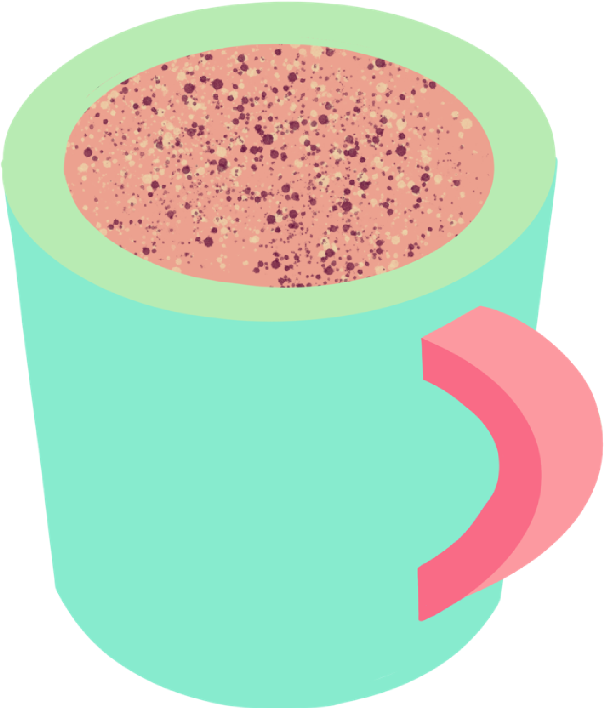

# Coffee Cram

For my Milestone 2 project I have created a barista simulation game in javascript. The game randomly generates a drink name for the user to then select the correct ingredients to create that particular drink.
I wanted to create something fun that could potentially be used as a tool for users to brush up on their coffee drink knowledge, perhaps even during a training setting as an ice-breaker exercise. As in my previous project, I have proceeding with the mobile first' design technique to ensure my game can be accessed on the go on mobiles and tablets, not just on laptops and computers, so the site is fully responsive.

[Link to Coffee Cram live site](https://kateuj.github.io/coffee_cram/)

## Table of Contents

1. [Planning & Development](#planning--development)
2. [Features](#features)
3. [Testing](#testing)
4. [Deployment](#deployment)
5. [Languages](#languages)
6. [Media Queries](#media-queries)
7. [Software](#software)
8. [Code](#code)
9. [Credits](#credits)

# Planning & Development #

### Site Purpose
This game is been designed mainly to create a positive emotional response through entertainment. It could also be used as an informal and fun introduction for barista training where the trainer could use this as a tool to test their trainee's knowledge of drinks before and after training to have a constructive comparison on how their knowledge has been built and any areas for improvement.

### Target Audience

Broadly, the game is aimed at anyone with an interest in coffee, which could include people seeking entertainment in the form of a quiz, but also as mentioned above for trainee barista to revise their knowledge, as well as barista trainers to used as an energy boosting / ice-breaking tool in training sessions with their trainees.

### User Needs

#### User Stories
1. User interested in coffee wants seeks coffee content based entertainment.
2. A barista trainee wanting to test their drink making knowledge.
3. A barista trainer uses the game as a tool to test their trainees' knowledge.

### Site Objectives

* Test user's knowledge of coffee drink making.
* Give the user a positive emotion experience with bright and fun colours and imagery.
* Build responsive game that works on mobile, tablet and desktop.
* Make the game easy to use with rules explained.
* Easy to navigate around and find key information.
* The option to view instructions anytime, to help the user revise the ingredients for each drink and refresh their memory easily.
* A good UI site flow.
* Provide the users with a way of contacting me and submitting a message to my email inbox.
* To be accessible for screen readers.
* To be able to reset the game easily.
* Links to the creator's social media in footer.

### Approach

* User experience design will be planned and carefully considered when designing the flow of layout of the game.
* The site will provide users links through to my social media accounts to contact me.
* The content of the site will be family-friendly and accessible to all.
* The game design will be consistent and visually engaging for the users.

### Research

I looked at other javascript-based games before making a decision on what I wanted to create, to see what was possible using the javascript concepts and skills I have learnt recently.

Sites included:
* [Burger Make](https://www.culinaryschools.org/kids-games/burger-maker/)
* [Hang Man](https://codepen.io/cathydutton/pen/JjpxMm)

Thoughts noted:
* Minimalist design.
* Responsive design.
* Game on one page.
* Pop up with instructions included.

All of the above, I have reflecting in the design of my own website.

### Wireframes

I used Figma and Balsamiq to plan and design my wireframes and user journey. I like using Figma in particular because it always you to brainstorm and keep all ideas and inspiration in one place as a singular visual to refer back to, which has been very useful throughout the project. I designed my site in mobile format initially before moving onto bigger screens, to ensure responsiveness was considered, especially since most users will predominantly use their phones to access this game.
I have changed a features along the way after considering user experience, for instance, I chose not to add a drop down menu at the top of the mobile version due to the site only being two pages long and felt it unnecessary in the end, due to the link to the contact page being below the game. If I had included an accordion nav bar at the top it would have pushed the game content further down the screen, meaning the user may need to scroll to see all the ingredients, which I decided was not acceptable for a good user experience.

#### Mobile Design Wireframe

#### Tablet Design Wireframe

#### Desktop Design Wireframe

[Link to my Figma page](https://www.figma.com/file/sE1FXwAGFZf3FEYIDAB8l0/Milestone-2---Coffee-Cram?type=design&node-id=0%3A1&mode=design&t=spVJTdSswAGCzuT1-1)

### Colour Scheme

After looking at coffee based content, branding and cafe simulator games, I found a lot of them to have quite muted, bland colour palettes, due to coffee being brown and having to work with that colour predominantly. However I was adamant to make this game as visually exciting as possible, so I looked at retro game palettes as well as bright 'vaporwave' colours to form my own striking colour palette to engage the user. The retro look and feel was intentional to invoke a cosy, reminiscent experience for users.
I made sure I had a good mix of high contrasting colours for good readability, which I have learn is important to consider when designing a website or application to ensure inclusivity for all users.

### Graphics

I was conscious that with 6 different ingredients and over 6 different variations of drinks, that this game could end up looking visually confusing if not approached carefully. I chose to create simple, isometric, flat graphics, which are in-keeping with the retro feel, but also creating a minimalist look and feel to keep the game approachable and not too overwhelming for the user.

### Typography

I chose a retro pixelated style font for headings and the logo for the game to accentuate the retro feel of the game, but also coupled it with Rubik, a simple, easy to read sans-serif font, for any body text sentences etc. to maintain good readability and in turn a good user experience.

# Features #

## Existing Features

### General

* My site is fully responsive and can be viewed and used effectively on all screen sizes down to 320px width by 480px height.
* I have considered readability contrast carefully for all visual elements.
* I have included a Favicon page tab icon to make the page look professional and consistent.

### Logo

* I created my simple text logo using the Silkscreen font to give it the retro gaming feel.

## Game page

### Instructions Pop-Up

* I created an animated gif for the centre of the landing page to add to the initial visual impact of the site to draw users in. I have kept it in a hand-drawn style to keep it fun and intriguing for a younger audience and to get my own personality across to the user to make it feel more casual and relatable.

### Footer

* I have included links to my social media profiles - TikTok, Instagram, Patreon within my footer.
* They are the standard recognisable icons for each, so easily recognisable by the user.
* The links all open in separate windows so that the user does not lose the site in their browser and have to manually navigate back, which again is all part of creating a positive, easy user experience for them.
* I have also added a contact icon for those who know they want to contact me as soon as they land on my website. Link directs them to my About page with contact form available.

## Portfolio page

### Image Gallery

* Using the Bootstrap Grid system, I created a responsive image gallery to showcase my work on my Portfolio page.

## About page

### Contact Form

* To ensure that users can contact me for potential future projects etc. I have included a contact form on my About page. It is fully responsive, changing size to suit screen size.
* It is also in keeping with the colour scheme of the site using CSS to maintain consistency and professionalism across the site.
* Once the user has submitted their form, they are re-directed to a thank-you page to assure them their form has been submitted. They are then, re-directed back to the site after 5 seconds for a positive user experience by anticipating their needs. 

## Thank you page

* Users are directed to this page when they submit a contact form. It re-directs back to site after 5 seconds. 

## Possible Future Features

### Interactive Portfolio Gallery
* I would like to add JavaScript to the portfolio page to allow users to click on the images and get an embedded pop up of the image full screen, with a title and blurb included with each. This would give a bit more context to the pieces and allow users to view them in more depth if required.

### Announcement Bar
* An announcement bar that sat above the navigation bar would be desirable to bring to the attention of any user if there have been any updates to the site, for example, new artwork available to view.

### A Print Shop

* An online shop where users could buy any of the artwork as a digital or physical print.

### Animated Hero Background

* I attempted a gently scrolling background animation for the Home page but unfortunately I could not get it to function at a standard I was happy with, so in future, I would like to revisit this, as I feel it would have added something to the visual impact of the Home page.

### Live Instagram Feed
* In the future I would love to add a live Instagram feed on my portfolio page to show the most up to date artwork, as well as giving the users a feel for who I am, to make me more approachable for users.

# Testing

## Testing during Development

* Throughout the process of making this website, I tested my code and CSS a lot using the preview window extension within VS Code, as well as within a chrome browser. With chrome browser I could Chrome Developer Tools to test responsiveness as well as troubleshoot any spacing issues or bugs.
* I would also consistently commit and push work to Github to then view live site and check responsiveness on my mobile and tablet devices, as well as passing onto friends and family to test on their devices.
* I have also tested my site in the main browsers available, which include:

  * Google Chrome
  * Mozilla Firefox
  * Apple Safari
  * Microsoft Edge

### Testing the Home page
* **Navigation Bar**
  * First thing I tested was the nav bar to check all links worked correctly. I also checked the external link for 'Support' opened a new window, so as not to navigate the user away from my site completely.
  * This nav bar is based on a responsive Bootstrap snippet available, which I edited to suit colour scheme and typeface, as well as background image.
  * Getting the nav bar to be a suitable thickness for different screen sizes took some tweaking in CSS with media queries, cross-checking my edits in the VS code live preview to get it to look effective.
  * Initially the background of the nav bar was not showing the same part of the image as the hero background behind as the screen size got smaller, but after trouble shooting, I found a simple fix was to put 'fixed' in the CSS for the nav bar background to have it move and reduce in the same way as the hero background.

* **Body content**
  * I have used the Bootstrap grid system in my site to structure my pages, as I found it to be reliable to use in the Code Institute exercises for responsiveness. So, I tested this section with Chrome Developer Tools, editing with CSS and media queries to make sure responsiveness was suitable on all screen sizes.
  * The portrait GIF in the centre was initially appearing under the nav bar on smaller screens when tested, so I resolved this by creating media queries for the smaller screen sizes to change the top margin above it where appropriate.
  * The 3 images were impactful on the larger screens but from tablet screen-size downward, the two image on one line was enough, so I change my strategy in the end to make the third image disappear on smaller screens using a media query.

* **Footer**
  * An initial bug that I worked on, was a white space below the footer, which I checked over in Chrome Developer Tools initially but was still unsure as to the resolution. After doing some research, I found help at the following site for a simple piece of CSS code: [30 Seconds of Code](https://www.30secondsofcode.org/css/s/footer-at-the-bottom/#:~:text=This%20is%20done%20by%20setting,it%20and%20its%20previous%20sibling)
  * I then tested all the links to make sure they worked and that the external links to social media accounts, opened new windows for the links when clicked on. This all worked effectively.
  * The footer was not appearing vertically or horizontally centralised throughout the site, even though the styling was centred. Upon closer inspection in Chrome Developer Tools, I found a margin underneath the icons, as well as padding on the left. I tested a solution in the Developer Tools to cancel these out, found it to be successful and then proceeded to add it into my own CSS code.

  

### Testing the Portfolio page

* **Header**
  * Testing showed that the headers throughout the site all consistently followed the styling CSS rule I had created for them.
  
* **Image Grid**
  * When testing responsiveness of this section, I found that the right margin was not equal to the left, causing the image grid to not sit centrally on the page. After some trial and error, I put the image grid into a separate div container from the header, which resolved the issue.

### Testing the About page

* **Text section**
  * Through a lot of trial and error, I tested this page the most rigorously for responsiveness, as I found it to be the most complex content and layout-wise. I evaluated the paragraph text on smaller screens and found it to be too small to comfortably read, so I increased the font size with media queries for the smaller screens.
  * I also found my line break element was not displaying central to the text when originally tested and I could not centralise it with CSS initially. However after researching it, I managed to solve this bug after learning about margin inline CSS rules at this site [MDN Web Docs](https://developer.mozilla.org/en-US/docs/Web/CSS/margin-inline).
  * I also had an issue where the line break was appearing at a low opacity, which must have been a carried over style from the Bootstrap code in my site. To resolve this bug, I declared 100% opacity on the hr elements.

* **Image and GIF**
  * When tested on different screen sizes I had a lot of issues with the image and the GIF on this page not being responsive and causing there to be a large white margin on the right-hand side of the site and a horizontal scroll. I found the fix to this bug in the end to be setting the width of each to '50vh' on the desktop and tablet screens to keep it responsive and make sure it never caused an overhang.

* **Contact Form**
  * I based this form on the code we learnt in the 'Love Running' exercise I completed. Upon testing my styling, I found the margins to be too wide on smaller screens, which I sorted with a media query to reduce them in size.
  * I tested the submit button to find that it does take the user to a thank-you and successfully re-direct back to site after 5 seconds.

### Testing the Thank you page
  * Successfully re-directs back to site after 5 seconds when tested.
  * Tested responsiveness of text and GIF, all of which work effectively.

## Validator Testing

### W3C Validator
I ran my site pages through the W3C validator and I received multiple errors. These included:

* 'Trailing slash on void elements' on all pages, where some elements in the header had unnecessary slashes at the end of their tags.

* Remove sections, just use DIVs when the content did not include headers.

* Needed to move a paragraph end tag above the "hr" element on the Index page.

* Had a stray end div on the Portfolio page.

* Unclosed div elements, which I resolved by adding in end tags.

* JavaScript placement was causing an error, as it was placed after the body tag, so needed to move to inside body tag to resolve the issue.

I corrected the code and all three pages now return no html errors.

### CSS Jigsaw Validator
I put the CSS stylesheet through the Jigsaw Validator and it returned no errors.

## Performance Testing

Using the Chrome Developer Tools Lighthouse reports, I was able to test the performance of my site pages and improve it as a result.

### Desktop
My initial desktop performance came out as below:

  

To improve my score, I did the following:
* Updated button text colour in form to a darker colour to improve readability contrast and site accessibility.

* Added aria labels to the links across the site to improve accessibility score.
* Reduced image sizes to improve performance.

* Added meta description and author tags to all pages to improve SEO score.

My score improved after all these changes:

### Mobile

The same errors for desktop came up in mobile as well, but after the same tweaks, the performance came out as:

* Performance on mobile could still be improved by reducing image sizes.

# Deployment

## GitHub pages
I used GitHub pages to deploy my site. This required me to go to my project repository and then:
1. Click on the 'Settings' tab.
2. Select 'Pages' from the menu that appears on the left.
3. Select 'Deploy from a branch'.
4. Select 'Main' in the drop-down menu called 'Select Branch'.
5. Then alongside 'Main', there is a folder dropdown where you select '/Root'.
6. Click 'Save' button.
7. Refresh the page and a link to the live project will appear at the top of the page.

## Forking a GitHub repository
Forking allows users to make a copy of an original repository in GitHub and view and make changes to it without changing the original repository.
To create a fork:
1. Once logged into GitHub, follow the link to your chosen GitHub repository, or use the search bar to find it on the GitHub home page.
2. Once in the repository window, click the 'Fork' drop down arrow button in the top right-hand corner.
3. Select 'Create new fork'.
4. Check the details in the window before clicking the green 'Create Fork' button.
5. You will now be able to find the copy of the repository in your own GitHub account.

## Making a Local Clone
1. Once logged into GitHub, follow the link to your chosen GitHub repository, or use the search bar to find it on the GitHub home page.
2. Once in the repository window, click the green 'Code' button.
3. To clone the repository using HTTPS, copy the link provided below the HTTPS header.
4. Open a terminal in your code editor.
5. Change the location in the current working directory to where you want the cloned directory to be created.
6. Type "git clone" into the terminal, and then paste the URL you copied and click enter.
7. This should have created a local clone of the repository.

Here is the live link to my website - <https://kateuj.github.io/kate-brush-portfolio/index.html>

# Languages

* I used HTML and CSS to create this site.
* Bootstrap v5.3.2 was used and built upon for features such as the responsive navigation bar and page layout.

# Media Queries

* I used Media Queries to debug and override some display issues that were not rectified with Bootstrap's responsive layouts.

# Software

* I used Visual Studio Code to create, edit, preview and push my code to my Github repository.
* Git and Github for version control.
* I used Procreate for my sketches, planning and design work, as well for producing the logo, hero background image and both animated GIFs on the site.
* Figma was used as a design board to lay out my wireframes and keep a copy of my design thought process all in one place.
* Adobe Photoshop was used to create visual mock-ups for this document, as well as reformatting all my images as .webp files to reduce file size and in turn improve the performance of my site.

# Code
* **Navigation Bar** - I tailored this [Bootstrap code](https://getbootstrap.com/docs/5.0/components/navbar/) snippet to create my Navigation bar.

* **Contact form** - this was based on the code used in the 'Love Running' exercise of Code Institute.

* **Footer** - code is based on the code used in the 'Love Running' exercise of Code Institute.

* **Thank-you page** - I used this code snippet to get the Thank You page to re-direct back to the site after 5 seconds. This was from a [Stack Overflow thread.](https://stackoverflow.com/questions/3292038/redirect-website-after-specified-amount-of-time)

* **Favicon** - I used a [Favicon generator](https://favicon.io/) to create the appropriate files for me to upload to my site, as well as this code snippet to install it site-wide.

# Credits

* Code Institute Bootstrap lessons helped me with working out how to use the Bootstrap grid layout on my pages.
* Google fonts for ['Josefin Slab' typography.](https://fonts.google.com/specimen/Josefin+Slab)

## Content

* [Image for visual mock up at top of README document by CosmoStudio</a> on Freepik.](https://www.freepik.com/psd/desktop-tablet-phone-mockup)
* All illustrations, animated GIFs and images are my own work under my pseudonym 'Kate Brush'.

### Thanks

* [Harsivo Edu](https://www.youtube.com/watch?v=lYiE5lBS13E&ab_channel=HarsivoEdu) for teaching me how to set up VS Code.
* Martina Terlevic my CI mentor, for her invaluable advice.
* [Kera Cudmore](https://github.com/kera-cudmore/readme-examples/blob/main/README.md#italic-bold-and-code) for showing how to form a README file.
* The big and little human beings of the Ulloa-James household who have been very patient with me, allowing me the time day or night to focus on this project.

https://www.youtube.com/watch?v=Qt-70hrdJZI&ab_channel=LearnWeb text overlay for images

https://stackoverflow.com/questions/23645439/add-time-delay-to-javascript-popup delay time out function

bugs
random drink not refresh page
update order count and score
emailjs not feeding in parameter - added in js script to fix
https://www.youtube.com/watch?v=r_PL0K2fGkY&ab_channel=FlorinPop
when how to play click the timer gets quicker

https://www.youtube.com/watch?v=r_PL0K2fGkY&ab_channel=FlorinPop